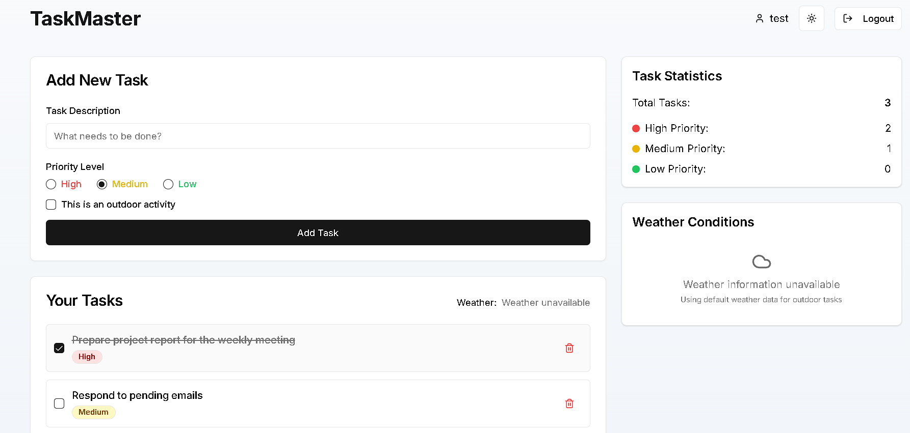

# Todo App with Weather Integration
A responsive todo application with real-time weather integration built with React, Redux, and OpenWeatherMap API.

## Features

- 📝 **Task Management**
  - Add, edit, and delete tasks
  - Set priority levels (High/Medium/Low)
  - Local storage persistence

- 🌦️ **Weather Integration**
  - Automatic location detection
  - Current temperature and conditions
  - Fallback to London weather

- 🔒 **User Authentication**
  - Mock login/logout flow
  - Protected routes

- 📱 **Responsive Design**
  - Mobile-first approach
  - Works on all screen sizes

## Screenshots

| Feature | Preview |
|---------|---------|
  |
 |
[Main Screen-3](./images/ss3.png) |
  |

## Installation

1. **Clone the repository:**
```bash
git clone https://github.com/rkd-2004/todo-app.git
cd todo-app

2. **Install dependencies:**

bash
Copy
npm install
# or
pnpm install

3. **Create .env file:**

env
REACT_APP_WEATHER_API_KEY=your_api_key_here

4. **Start development server:**

bash
Copy
npm start
